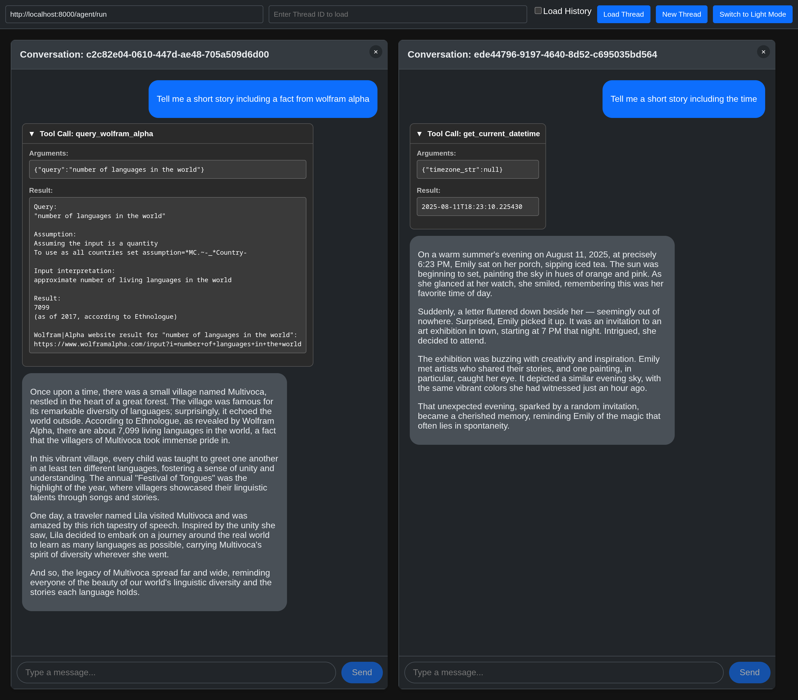

# react-ag-ui

A lightweight and unopinionated React component library for building chat interfaces that connect to an AG-UI compliant backend.

This library provides the core UI components and state management needed to create a feature-rich chat experience, while giving you complete control over styling and theming.

## Features

- **State Management:** Simple and robust state management powered by `@ag-ui/client`.
- **Dynamic Chat Title:** The chat title can be dynamically updated by the backend agent.
- **Unopinionated Styling:** No CSS-in-JS libraries. Style with plain CSS, CSS Modules, or your favorite styling solution.
- **Flexible Theming:** Easily customize the look and feel using CSS Custom Properties.
- **TypeScript Support:** Fully typed for a better developer experience.
- **Component-Based:** Includes essential components like `MessageList`, `MessageInput`, and `ChatHeader`.

## Demo




See the [Demo Application](#demo-application) section for detailed usage instructions.

## Installation

```bash
npm install react-ag-ui
```

**Note:** This library has `react`, `react-dom`, and `@ag-ui/client` as peer dependencies. You will need to have them installed in your project.

## Quick Start

To get started, you need to wrap your chat components with the `ChatProvider` and import the required base styles.

1.  **Import the CSS:**
    In your main application file (e.g., `App.tsx` or `index.tsx`), import the stylesheet. This file contains all the necessary structural styles and default theme.

    ```tsx
    import 'react-ag-ui/dist/styles.css';
    ```

2.  **Set up the Chat:**
    Create an `HttpAgent` instance and pass it to the `ChatProvider`. Then, compose your chat UI using the provided components.

    ```tsx
    import React from 'react';
    import { HttpAgent, AbstractAgent } from '@ag-ui/client';
    import { ChatProvider, ChatHeader, MessageList, MessageInput } from 'react-ag-ui';
    import 'react-ag-ui/dist/styles.css';

    // Configure an agent instance
    const agent: AbstractAgent = new HttpAgent({
      url: 'http://localhost:8000/agent/run',
      description: 'My Awesome Chatbot',
    });

    const App: React.FC = () => {
      return (
        <ChatProvider agent={agent}>
          <div style={{ width: '400px', height: '600px', border: '1px solid #ccc', display: 'flex', flexDirection: 'column' }}>
            <ChatHeader />
            <div style={{ flex: 1, overflowY: 'auto', padding: '10px' }}>
              <MessageList />
            </div>
            <MessageInput />
          </div>
        </ChatProvider>
      );
    };

    export default App;
    ```

## API

### `<ChatProvider>`

The `ChatProvider` is the root component that manages the chat state. It must wrap all other chat components.

**Props:**

-   `agent`: An instance of a class that extends `AbstractAgent` from `@ag-ui/client` (e.g., `HttpAgent`).
-   `threadId` (optional): A string representing the conversation thread to load.
-   `loadHistory` (optional): A boolean flag that determines whether to automatically load history when a `threadId` is provided. Defaults to `false`. When `true` and `threadId` is provided, the chat will load the history for that thread by sending an agent request with an empty message list. **Note:** Your backend must support loading messages in this manner for history loading to work properly.

### Components

These components can be used within a `ChatProvider`.

-   `<ChatHeader />`: Displays the header of the chat. The title is dynamically set by the agent's state (via a `chatTitle` property), falling back to the agent's static `description`, and finally to 'Chat'.
-   `<MessageList />`: Renders the list of messages in the conversation.
-   `<MessageInput />`: Provides a text input and send button for the user.

### Backend Integration

**Dynamic Chat Title:**
To set a dynamic chat title, your backend should update the shared state with a `chatTitle` property:

```python
# Example: Setting chat title from backend
agent.state.chatTitle = "Customer Support - John Doe"
```

The `ChatHeader` component will automatically display this title and update in real-time when the backend changes it.

**History Loading:**
When `loadHistory={true}` is set and a `threadId` is provided, the frontend will call your agent with an empty message list. Your backend should detect this scenario and return the conversation history for that thread.

This allows users to resume previous conversations when the history loading feature is enabled.

## Styling and Theming

The library is designed to be easily themed using CSS Custom Properties (variables). You can override the default styles by redefining these variables in your own CSS file.

### Applying the Dark Theme

To enable the built-in dark theme, add the `data-theme="dark"` attribute to a parent element.

```html
<body data-theme="dark">
  <!-- Your React App -->
</body>
```

### Customizing the Theme

To create your own theme, override the CSS variables defined in the library. You can do this in a global stylesheet.

**Example: Creating a custom theme**

```css
/* your-styles.css */
:root {
  --ag-chat-primary-color: #e60023; /* Custom brand color */
  --ag-chat-background: #f0f2f5;
  --ag-chat-font-family: 'Georgia', serif;
  --ag-chat-message-border-radius: 8px;
  --ag-chat-user-message-bg: #e60023;
}
```

### Available CSS Variables

Here is a list of all available variables and their default values.

| Variable                                   | Default (Light)                                                | Default (Dark)                               | Description                                  |
| ------------------------------------------ | -------------------------------------------------------------- | -------------------------------------------- | -------------------------------------------- |
| `--ag-chat-primary-color`                  | `#007bff`                                                      | `#0d6efd`                                    | Primary brand color for buttons and accents. |
| `--ag-chat-app-background`                 | `#f0f2f5`                                                      | `#121212`                                    | Background color of the application wrapping the chat. |
| `--ag-chat-text-color`                     | `#212529`                                                      | `#e9ecef`                                    | Default text color.                          |
| `--ag-chat-background`                     | `#ffffff`                                                      | `#212529`                                    | Main background color of the chat container. |
| `--ag-chat-border-color`                   | `#dee2e6`                                                      | `#495057`                                    | Border color for elements.                   |
| `--ag-chat-header-bg`                      | `#f8f9fa`                                                      | `#343a40`                                    | Background color of the chat header.         |
| `--ag-chat-user-message-bg`                | `#007bff`                                                      | `#0d6efd`                                    | Background color for user messages.          |
| `--ag-chat-user-message-text-color`        | `#ffffff`                                                      | `#ffffff`                                    | Text color for user messages.                |
| `--ag-chat-assistant-message-bg`           | `#f1f3f5`                                                      | `#495057`                                    | Background color for assistant messages.     |
| `--ag-chat-assistant-message-text-color`   | `#212529`                                                      | `#e9ecef`                                    | Text color for assistant messages.           |
| `--ag-chat-font-family`                    | `-apple-system, BlinkMacSystemFont, 'Segoe UI', ...`            | `-apple-system, BlinkMacSystemFont, 'Segoe UI', ...` | Font family for the chat components.         |
| `--ag-chat-header-font-size`               | `1.1rem`                                                       | `1.1rem`                                     | Font size for the chat header.               |
| `--ag-chat-message-font-size`              | `1rem`                                                         | `1rem`                                       | Font size for messages.                      |
| `--ag-chat-tool-message-border-color`      | `#e0e0e0`                                                      | `#555`                                       | Border color for tool messages.              |
| `--ag-chat-tool-message-background-color`  | `#f7f7f7`                                                      | `#333`                                       | Background color for tool messages.          |
| `--ag-chat-tool-header-text-color`         | `#333`                                                         | `#eee`                                       | Text color for tool message headers.         |
| `--ag-chat-tool-details-border-color`      | `#e0e0e0`                                                      | `#555`                                       | Border color for tool message details.       |
| `--ag-chat-tool-details-strong-color`      | `#555`                                                         | `#ccc`                                       | Text color for strong text in tool details.  |
| `--ag-chat-tool-details-pre-background-color` | `#fff`                                                         | `#222`                                       | Background color for preformatted text in tool details. |
| `--ag-chat-tool-details-pre-border-color`  | `#ddd`                                                         | `#444`                                       | Border color for preformatted text in tool details. |
| `--ag-chat-message-padding`                | `10px 15px`                                                    | `10px 15px`                                  | Padding inside message bubbles.              |
| `--ag-chat-message-border-radius`          | `18px`                                                         | `18px`                                       | Border radius for message bubbles.           |

## Development

This project uses Rollup for bundling. There are two separate build configurations: one for the library and one for the demo application.

### Library Build

To build the library for production, run:

```bash
npm run build
```

This will generate the distributable files in the `dist/` directory.

### Demo Application

To run the demo application locally, use:

```bash
npm run start:demo
```

This will start a development server and watch for changes in the `demo/` directory.

The demo application allows you to test the chat components in a local environment. Features include:

- **Agent URL Configuration**: Specify the backend agent URL (defaults to `http://localhost:8000/agent/run`)
- **Thread Management**: Load existing chat threads by providing a thread ID, or create new threads
- **Load History Toggle**: Use the "Load History" checkbox to control whether history is automatically loaded when a thread ID is provided
- **Theme Switching**: Toggle between light and dark themes
- **Multiple Chat Windows**: Open multiple chat sessions simultaneously

**Usage:**
1. Enter your agent URL in the first input field
2. To load an existing thread: Enter the thread ID, check "Load History" if you want to load the conversation history, then click "Load Thread"
3. To start a new conversation: Click "New Thread"